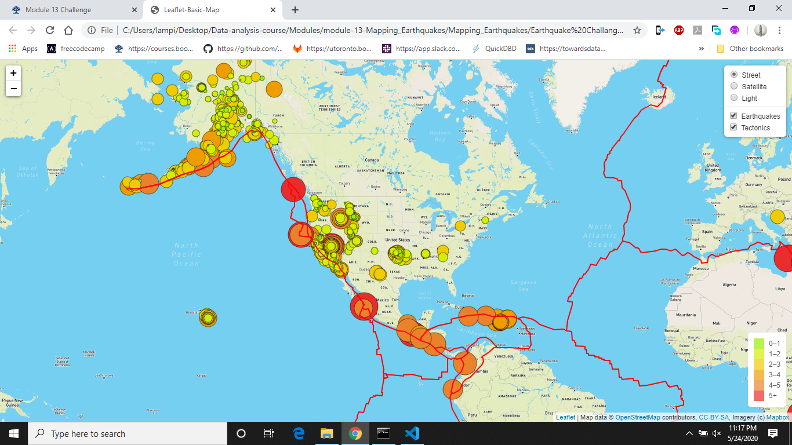

# Mapping_Earthquakes

# RESOURCES

HTML, Javascript, CSS, GeoJSON, Leflet.js and MapBox

## Purpose
The purpose of this project is to visually show the differences between the magnitudes of earthquakes all over the world for the last seven days.

## Tasks
To complete this project, use a URL for GeoJSON earthquake data from the USGS website and retrieve geographical coordinates and the magnitudes of earthquakes for the last seven days. Then add the data to a map.

// First we created layers for our map, we used 3 different types, streets, stellite and light mode

let streets = L.tileLayer('https://api.mapbox.com/styles/v1/mapbox/streets-v11/tiles/{z}/{x}/{y}?access_token={accessToken}', {
attribution: 'Map data © <a href="https://www.openstreetmap.org/">OpenStreetMap</a> contributors, <a href="https://creativecommons.org/licenses/by-sa/2.0/">CC-BY-SA</a>, Imagery (c) <a href="https://www.mapbox.com/">Mapbox</a>',
	maxZoom: 18,
	//id: 'mapbox.streets',
	accessToken: API_KEY
});

let satelliteStreets = L.tileLayer('https://api.mapbox.com/styles/v1/mapbox/satellite-streets-v11/tiles/{z}/{x}/{y}?access_token={accessToken}', {
attribution: 'Map data © <a href="https://www.openstreetmap.org/">OpenStreetMap</a> contributors, <a href="https://creativecommons.org/licenses/by-sa/2.0/">CC-BY-SA</a>, Imagery (c) <a href="https://www.mapbox.com/">Mapbox</a>',
	maxZoom: 18,
	accessToken: API_KEY
});

let light = L.tileLayer('https://api.mapbox.com/styles/v1/mapbox/light-v10/tiles/{z}/{x}/{y}?access_token={accessToken}', {
attribution: 'Map data © <a href="https://www.openstreetmap.org/">OpenStreetMap</a> contributors, <a href="https://creativecommons.org/licenses/by-sa/2.0/">CC-BY-SA</a>, Imagery (c) <a href="https://www.mapbox.com/">Mapbox</a>',
	maxZoom: 18,
	accessToken: API_KEY
});

// Create a base layer that holds both maps.
let baseMaps = {
	"Street": streets,
	"Satellite" : satelliteStreets,
	"Light" : light
  };

  // Create the map object with center, zoom level and default layer.
let map = L.map('mapid', {
	center: [39.5, -98.5],
	zoom: 3,
	layers: [streets]
})

// Retrieve the earthquake GeoJSON data.
d3.json("https://earthquake.usgs.gov/earthquakes/feed/v1.0/summary/all_week.geojson").then(function(data) {

// Creating a GeoJSON layer with the retrieved data.
L.geoJson(data, {
    // We turn each feature into a circleMarker on the map.
    pointToLayer: function(feature, latlng) {
        console.log(data);
        return L.circleMarker(latlng);
      },
    // We set the style for each circleMarker using our styleInfo function.
  style: styleInfo,
    // We create a popup for each circleMarker to display the magnitude and
    //  location of the earthquake after the marker has been created and styled.
    onEachFeature: function(feature, layer) {
    layer.bindPopup("Magnitude: " + feature.properties.mag + " Location: " + feature.properties.place);
  }
}).addTo(earthquakes);
});

// This function returns the style data for each of the earthquakes we plot on
// the map. We pass the magnitude of the earthquake into two separate functions
// to calculate the color and radius.
function styleInfo(feature) {
	return {
	  opacity: 1,
	  fillOpacity: 1,
	  fillColor: getColor(feature.properties.mag),
	  color: "#000000",
	  radius: getRadius(feature.properties.mag),
	  stroke: true,
	  weight: 0.5
	};
  }

// This function determines the color of the circle based on the magnitude of the earthquake.
function getColor(magnitude) {
	if (magnitude > 5) {
	  return "#ea2c2c";
	}
	if (magnitude > 4) {
	  return "#ea822c";
	}
	if (magnitude > 3) {
	  return "#ee9c00";
	}
	if (magnitude > 2) {
	  return "#eecc00";
	}
	if (magnitude > 1) {
	  return "#d4ee00";
	}
	return "#98ee00";
  }

  // This function determines the radius of the earthquake marker based on its magnitude.
// Earthquakes with a magnitude of 0 will be plotted with a radius of 1.
function getRadius(magnitude) {
	if (magnitude === 0) {
	  return 1;
	}
	return magnitude * 4;
  }

  let tectonicData = "https://raw.githubusercontent.com/fraxen/tectonicplates/master/GeoJSON/PB2002_boundaries.json"

  d3.json(tectonicData).then(function(data) {
  
  // Creating a GeoJSON layer with the retrieved data.
  
	  console.log(data);
  L.geoJSON(data, {
	  style: myStyle
  }).addTo(tectonics);
  });

// Create the earthquake layer for our map.
let earthquakes = new L.layerGroup();
let tectonics = new L.layerGroup();

// We define an object that contains the overlays.
// This overlay will be visible all the time.
let overlays = {
	"Earthquakes": earthquakes,
	"Tectonics" : tectonics
  };

  // Then we add a control to the map that will allow the user to change
// which layers are visible.
L.control.layers(baseMaps, overlays).addTo(map);

// Create a legend control object.
let legend = L.control({
	position: "bottomright"
  });

  // Then add all the details for the legend.
legend.onAdd = function() {
	let div = L.DomUtil.create("div", "info legend");
	const magnitudes = [0, 1, 2, 3, 4, 5];
	const colors = [
	  "#98ee00",
	  "#d4ee00",
	  "#eecc00",
	  "#ee9c00",
	  "#ea822c",
	  "#ea2c2c"
	];

// Looping through our intervals to generate a label with a colored square for each interval.
for (var i = 0; i < magnitudes.length; i++) {
	console.log(colors[i]);
	div.innerHTML +=
	  "<i style='background: " + colors[i] + "'></i> " +
	  magnitudes[i] + (magnitudes[i + 1] ? "&ndash;" + magnitudes[i + 1] + " " : "+");
 }
  return div;
};

legend.addTo(map);
  

// Create a style for the lines.
let myStyle = {
	color: "red",
	weight: 2
}

## Results

We created a map to showcase last 7 days of earthquakes and tectonic plates. We also created an overlay to toggle different types of maps and earthquake and tectonic data.

